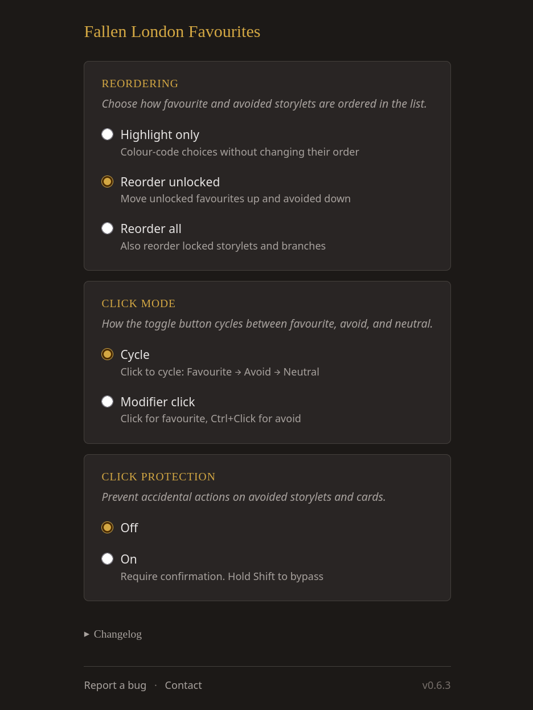

# Fallen London Favourites

A rewrite of [Playing Favourites](https://github.com/kav2k/fl_favourites) by [Alexander Kashev](https://github.com/kav2k)

Mark storylets, branches and cards as favourite or avoided in Fallen London. Favourites rise to the top, avoided sink to the bottom.

## Features

- Green/red highlights on favourite and avoided choices
- Automatic reordering: favourites up, avoided down (configurable)
- Optional click protection on avoided choices (Shift to bypass, long press on mobile)
- Two click modes: cycle through states, or click/Ctrl+Click (tap/long press on mobile)
- Settings sync across devices via Chrome Sync / Firefox Account
- Firefox for Android supported

<p>


</p>

<p>


</p>



## Install

- [Chrome Web Store](https://chromewebstore.google.com/detail/fallen-london-favourites/jkaoljkdjoecocmlnncdljoeeijlcjao)
- [Firefox Add-ons](https://addons.mozilla.org/firefox/addon/fallen-london-favourites/) (desktop and Android 142+)

## Development

Built with [WXT](https://wxt.dev/), TypeScript, Vite.

```bash
pnpm install
pnpm dev              # dev mode with hot reload
pnpm build            # Chrome production build
pnpm build:firefox    # Firefox production build
pnpm zip              # package for Chrome Web Store
pnpm zip:firefox      # package for Firefox AMO
pnpm test             # run tests
pnpm lint             # ESLint
pnpm format           # Prettier
```

## Feedback

Found a bug or have a suggestion? [Open an issue](https://github.com/gasovn/fallen-london-favourites/issues)

## License

MIT — see [LICENSE](LICENSE)
