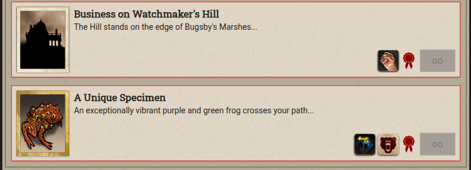
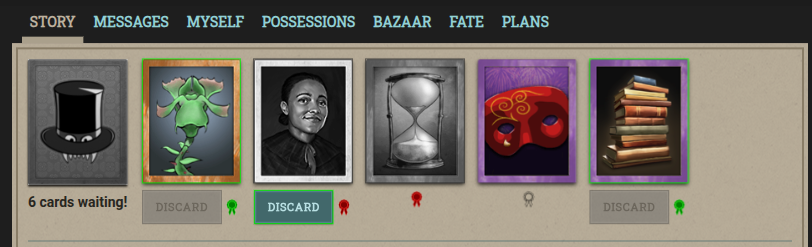

# Playing Favourites for Fallen London

A rewrite of [Playing Favourites](https://github.com/kav2k/fl_favourites) by [Alexander Kashev](https://github.com/kav2k)

An unofficial browser extension for Fallen London that lets you mark branches, storylets and cards as favourite or avoided.

## Features

- Mark branches, storylets and card discards as favourite (green) or avoided (red)
- Marked choices float to the top or bottom (configurable)
- Optional click protection on avoided branches
- Settings sync across browsers via Chrome Sync / Firefox Account

<p>


</p>



## Supported browsers

- Chrome (MV3)
- Firefox (MV2)

## Development

Built with [WXT](https://wxt.dev/), TypeScript, Vite.

```bash
pnpm install
pnpm dev              # dev mode with hot reload
pnpm build            # Chrome production build
pnpm build:firefox    # Firefox production build
pnpm zip              # package for Chrome Web Store
pnpm zip:firefox      # package for Firefox AMO
pnpm test             # run tests
pnpm lint             # ESLint
pnpm format           # Prettier
```

## Feedback

Found a bug or have a suggestion? [Open an issue](https://github.com/gasovn/fallen-london-favourites/issues)

## License

MIT — see [LICENSE](LICENSE)
